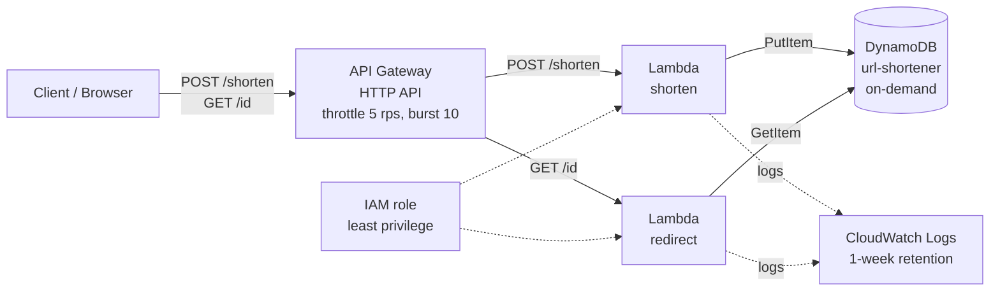

# Serverless URL Shortener on AWS

A serverless URL shortener built with API Gateway, Lambda, and DynamoDB. It has no servers to manage, scales with demand, and costs close to nothing when idle.

**Region:** `eu-west-1` (Ireland)
**Live API:** `https://ev62nu61b0.execute-api.eu-west-1.amazonaws.com`

---

## 1. Problem and Requirements

Long URLs are hard to share. This service turns a long URL into a short one and redirects visitors to the original.

**Functional requirements**

1. `POST /shorten` accepts a long URL and returns a short ID and short URL
2. `GET /{id}` redirects (HTTP 302) to the original URL
3. Invalid input returns a clear error (400); unknown IDs return 404

**Non-functional requirements**

| Requirement | Target |
|---|---|
| Availability | Managed, multi-AZ services (no single server to fail) |
| Cost | Pay per request; near $0 at demo traffic |
| Security | Least-privilege IAM, input validation, rate limiting |
| Operations | Centralized logs, no patching, no servers |

---

## 2. Architecture



**Request flows**

1. **Shorten:** the client sends a POST with a JSON body. API Gateway invokes the `shorten` Lambda, which validates the URL, generates a 7-character ID, and writes the item to DynamoDB with a condition that prevents overwriting an existing ID.
2. **Redirect:** the client requests `/{id}`. API Gateway invokes the `redirect` Lambda, which reads the item from DynamoDB and returns a 302 with a `Location` header.

---

## 3. Service Choices and Alternatives Considered

| Component | Chosen | Alternatives considered | Reason |
|---|---|---|---|
| API layer | API Gateway **HTTP API** | REST API, Lambda Function URLs | HTTP API is cheaper and simpler than REST API, and adds built-in throttling and logging that Function URLs lack |
| Compute | Lambda (Node.js 22, arm64, 128 MB) | EC2, ECS Fargate | No idle cost, no patching, scales per request; arm64 is cheaper per GB-second |
| Database | DynamoDB **on-demand** | DynamoDB provisioned, RDS | Key-value access pattern fits DynamoDB; on-demand costs almost nothing at low traffic, while provisioned capacity bills hourly even when idle |
| Observability | CloudWatch Logs | Third-party tooling | Native, no setup, retention controlled to limit cost |

**Decision note:** the table was first created in provisioned mode (1 RCU / 1 WCU). The calculator showed a fixed monthly estimate, so it was switched to on-demand to match the near-zero idle-cost goal.

---

## 4. Security Design

| Control | Implementation |
|---|---|
| Least-privilege IAM | Lambda role has `AWSLambdaBasicExecutionRole` plus an inline policy allowing only `dynamodb:PutItem` and `dynamodb:GetItem` on the single table ARN. No wildcard actions or resources |
| Input validation | URL parsed with the `URL` constructor; only `http:` and `https:` accepted |
| Overwrite protection | `PutItem` uses `attribute_not_exists(short_id)` |
| Rate limiting | API Gateway default route throttling: 5 requests/second, burst 10 |
| Encryption | DynamoDB encryption at rest (default); HTTPS enforced by API Gateway |
| Account hygiene | MFA on root, daily work through a non-root identity |

**Known gaps (documented honestly)**

1. No authentication: anyone can create short links
2. A shortener can be abused to hide malicious destinations; there is no URL reputation check or allow/deny list
3. No AWS WAF in front of the API

---

## 5. Resilience Design

| Failure scenario | Behavior |
|---|---|
| Lambda instance fails | Lambda retries on a new execution environment per invocation; no state held in the function |
| Availability Zone outage | API Gateway, Lambda, and DynamoDB are regional services spanning multiple AZs |
| Traffic spike | Lambda scales automatically; API Gateway throttling protects the backend and the bill |
| ID collision | Conditional write rejects the duplicate and the request returns 500. A retry loop is a planned improvement |
| Accidental data loss | Point-in-time recovery is not enabled (cost trade-off); recommended for production |

---

## 6. Cost Design

All components bill per request, so idle cost is close to zero.

| Service | Billing model | Cost controls applied |
|---|---|---|
| Lambda | Per request and duration | 128 MB memory, 5-second timeout |
| API Gateway (HTTP API) | Per million requests | Throttling at 5 rps, burst 10 |
| DynamoDB | On-demand, per read/write request | Chosen over provisioned to avoid hourly capacity charges |
| CloudWatch Logs | Per GB ingested and stored | 1-week retention on both log groups |

**Guardrails:** AWS Budget with a $1 threshold and email alerts.

**Measured cost:** *(fill in after checking Cost Explorer: month-to-date total and per-service breakdown)*

Estimate yours with the [AWS Pricing Calculator](https://calculator.aws/) and confirm against actual billing data.

---

## 7. Well-Architected Framework Mapping

| Pillar | How this project addresses it |
|---|---|
| Operational excellence | Centralized CloudWatch logs; managed services reduce operational burden; infrastructure-as-code version planned |
| Security | Least-privilege role, input validation, throttling, encryption at rest and in transit |
| Reliability | Multi-AZ managed services, stateless functions, conditional writes |
| Performance efficiency | Serverless scaling, DynamoDB single-key lookups, arm64 compute |
| Cost optimization | Pay-per-request model, on-demand DynamoDB, log retention, budget alert, small function sizing |
| Sustainability | No idle servers; compute used only when requests arrive |

---

## 8. API Reference

**Create a short URL**

```bash
curl -X POST https://ev62nu61b0.execute-api.eu-west-1.amazonaws.com/shorten \
  -H "Content-Type: application/json" \
  -d '{"url":"https://aws.amazon.com"}'
```

Response `201`:

```json
{ "short_id": "uw0IEtn", "short_url": "https://ev62nu61b0.execute-api.eu-west-1.amazonaws.com/uw0IEtn" }
```

**Follow a short URL:** `GET /{id}` returns `302` with a `Location` header.

| Status | Meaning |
|---|---|
| 201 | Short URL created |
| 302 | Redirect to the original URL |
| 400 | Missing or invalid URL |
| 404 | Short ID not found |
| 500 | Storage or lookup failure |

---

## 9. Deployment Steps (manual, console)

1. Create DynamoDB table `url-shortener`, partition key `short_id` (String), on-demand capacity
2. Create IAM role `url-shortener-lambda-role` with `AWSLambdaBasicExecutionRole` and an inline policy scoped to the table ARN (`PutItem`, `GetItem`)
3. Create Lambda `url-shortener-shorten` (Node.js 22, arm64, 128 MB, 5 s) with env var `TABLE_NAME=url-shortener`
4. Create Lambda `url-shortener-redirect` with the same settings
5. Create an HTTP API `url-shortener-api` with routes `POST /shorten` and `GET /{id}` integrated to the two functions, stage `$default` with auto-deploy
6. Set default route throttling to rate 5, burst 10
7. Set log retention to 1 week on both log groups
8. Create a $1 AWS Budget with email alerts

---

## 10. Teardown

Delete in this order to leave no billable resources:

1. API Gateway: delete `url-shortener-api`
2. Lambda: delete `url-shortener-shorten` and `url-shortener-redirect`
3. DynamoDB: delete table `url-shortener`
4. CloudWatch: delete the two `/aws/lambda/url-shortener-*` log groups
5. IAM: delete role `url-shortener-lambda-role`
6. Billing: keep or delete the budget as preferred

---

## 11. Future Improvements

1. Rebuild as infrastructure as code (Terraform or CloudFormation)
2. Add Cognito authentication for link creation
3. Add DynamoDB TTL for link expiry
4. Add a collision retry loop and click-count analytics
5. Add AWS WAF and a custom domain with ACM and Route 53
6. Add CI/CD with GitHub Actions using an OIDC role

---

## Screenshots

**1. Creating a short URL (201 response)**


**2. DynamoDB item written by the `shorten` function**


**3. CloudWatch log streams for the `shorten` function**


**4. API Gateway routes**


